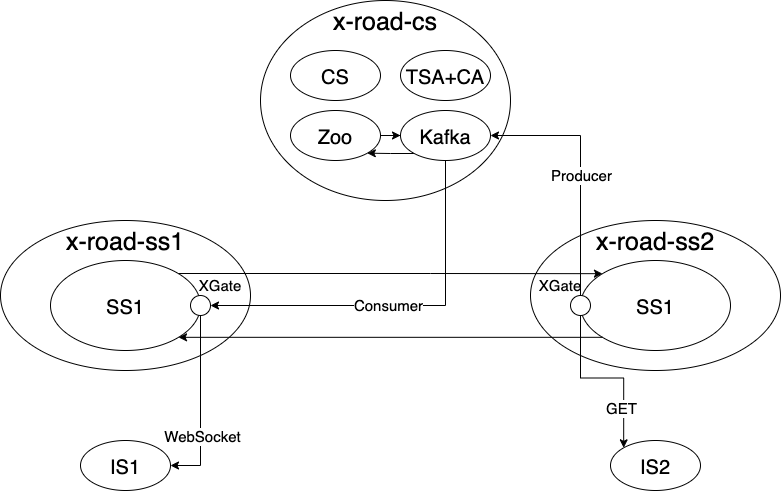

# X-Road Data Exchange Layer

[](https://jointxroad.slack.com/)
[](https://x-road.global/join-the-xroad-community)

 

## About the repository 

This repository contains information about the X-Road, source codes, its development, installation and documentation.

## X-Road source code

[Source code](https://github.com/nordic-institute/X-Road/tree/develop/src) of X-Road is open for all and it is licenced under MIT licence.

## Introduction to X-Road

Short [X-Road introduction video](https://youtu.be/9PaHinkJlvA)

**What is X-Road?**

X-Road, the data exchange layer for information systems, is a technological and organizational environment enabling a secure Internet-based data exchange between information systems.


X-Road Data Exchange Layer is a standardised, cohesive, collaborative, interoperable and secure data exchange layer that gives service providers a completely new kind of opportunity of making themselves visible in services directed at citizens, businesses and civil servants. Creating entities that combine many different services and data sources is easy and cost efficient.

* Improves the quality of existing services and products
* Enables new types of service innovations
* Savings in infrastructure, archiving and other costs
* Standardised data security and privacy protection
* Easy implementation, data access via interfaces – after connecting all included services are available

See [Data Exchange Layer X-Road](https://www.niis.org/data-exchange-layer-x-road/) for more information about X-Road.

## Development of X-Road

X-Road development model and all the related documentation is published and
maintained in the [X-Road Development](https://github.com/nordic-institute/X-Road-development/)
GitHub repository.

**How to contribute?**

Submit a pull request to [X-Road source code Github repository](https://github.com/nordic-institute/X-Road)
or an enhancement request to the [X-Road Service Desk](https://jira.niis.org/servicedesk/customer/portal/1).
[Sign up](https://jira.niis.org/secure/Signup!default.jspa) for an account and
get access to the [X-Road Service Desk](https://jira.niis.org/servicedesk/customer/portal/1) and
[X-Road Backlog](https://jira.niis.org/projects/XRDDEV/).

More information about contributions can be found in the [X-Road Development](https://github.com/nordic-institute/X-Road-development#how-to-contribute)
repository.

## X-Road installation

**How to build X-Road?**

See instructions in [src/BUILD.md](src/BUILD.md)

**Local installation**

X-Road central servers, configuration proxies and security servers can be automatically installed with the Ansible scripts found in ansible subdirectory. See instructions in [ansible/README.md](ansible/README.md)

## X-Road technical documentation

[Documentation table of contents](doc/README.md)

## Further information about X-Road

**More information about X-Road implementations**

Estonia - [X-tee](https://www.ria.ee/en/x-road.html)

Finland - [Suomi.fi-palveluväylä (in Finnish)](https://esuomi.fi/palveluntarjoajille/palveluvayla/)

**Contact information**

Estonia - [X-tee contacts](https://www.ria.ee/en/contact.html)

Finland - [Suomi.fi-palveluväylä contacts](https://esuomi.fi/contact-information/?lang=en)

## Support disclaimer

The following activities, among others, are undertaken by the
[Nordic Institute for Interoperability Solutions (NIIS)](https://www.niis.org/)
with regard to the X-Road core:

* management, development, verification, and audit of the source code
* administration of documentation
* administration of business and technical requirements
* conducting development
* developing and implementing principles of licensing and distribution
* providing second-line support for the NIIS members
* international cooperation.

Support for member organizations of X-tee and Suomi.fi-palveluväylä is provided
by [RIA](https://www.ria.ee) (X-tee) and [VRK](https://www.vrk.fi) (Suomi.fi-palveluväylä).

[X-Road Technology Partners](https://x-road.global/xroad-technology-partners) are enterprises providing X-Road consultation services, e.g. deploying independent X-Road instances, developing X-Road extensions and X-Road-compatible services, integrating informations systems with X-Road etc.

No support for X-Road deployment is provided here.

## X-Gate Demo

DISCLAIMER: X-Gate modifications are on branch "async-final". 

- [Download](https://kafka.apache.org/downloads) Kafka (last version is OK)
- Move to Kafka Unzipped/Untar folder
- Startup first Zookeeper and then the Kafka Broker 

```
./bin/zookeeper-server-start.sh ./config/zookeeper.properties
./bin/kafka-server-start.sh ./config/server.properties
```

- To run the demo, you need to setup default variables in class [XGateConfig](./src/main/java/ee/ria/xroad/xgate/XGateConfig.java). In particular:
  - IS\_KAFKA\_PORT\_DEFAULT indicates the address of the Kafka Broker
  - IS\_KAFKA\_ADDRESS\_DEFAULT indicates the port of the Kafka Broker
- Then, startup the X-Road environment through Ansible
- The setup should comprehend
  - Security Server 1
  - Security Server 2
  - Central Server 
  - TSA and CA (may be on the same machine as CS)
- Setup the global configurations
- Setup the subsystems
- Test it sending a synchronous GET request
  - NOTE: the IP addresses and member/subsystems names of the following requests refer to our development environment

```
curl -i -X GET "http://10.227.70.220/r1/DEMO/GOV/1234/TESTSERVICE/kore/school/" -H "accept:application/json" -H "X-Road-Client:DEMO/GOV/1234/TEST"
```

- Then, send an asynchronous handshake request

```
curl -i -X GET "http://10.227.70.220/r1/DEMO/GOV/1234/TESTSERVICE/kore/school/" -H "accept:application/json" -H "X-Road-Client:DEMO/GOV/1234/TEST" -H "x-road-async-handshake:true"
```

- Finally, setup a websocket listening to port 1234 on path "/xgatews"

```
wscat -c ws://10.227.70.220:1234/xgatews
```

### Other Useful Informations: 

- XGate components is all contained into [`xgate`](./src/proxy/src/main/java/ee/ria/xroad/xgate) package.
- The additional handshake headers names are included in the class [MimeUtils](./src/main/java/ee/ria/xroad/common/util/MimeUtils.java)
- The continuous pull of info from the school service has a maximum number of iterations (for demonstration purposes), if you want to render it contonuous, and remove the delay, remove the while condition and the `sleep` command in the class [ISInCommunicationGet](./src/main/java/ee/ria/xroad/xgate/ISInCommunicationGet.java)

### Final Schema depicting the demo components




